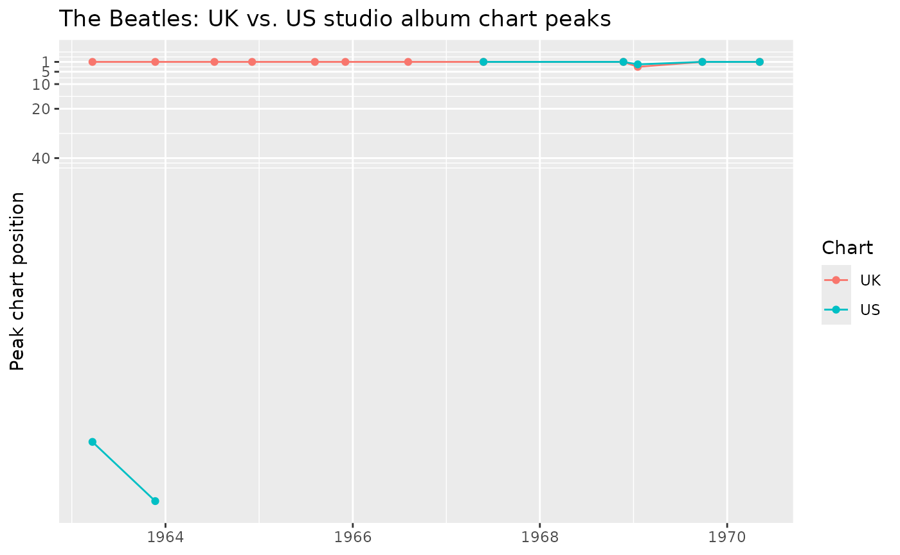

# Retrieving a Wikipedia Table: The Beatles' Studio Albums

``` r

library(wikitools)
library(dplyr)
#> 
#> Attaching package: 'dplyr'
#> The following objects are masked from 'package:stats':
#> 
#>     filter, lag
#> The following objects are masked from 'package:base':
#> 
#>     intersect, setdiff, setequal, union
library(stringr)
library(tidyr)
library(ggplot2)
```

`wikitools` is built to facilitate the retrieval and manipulation of
Wikipedia data. \[as_wikitable()\] converts an R data frame *into*
wikitext table markup for pasting into an article. \[get_wikitable()\]
goes the other direction: it fetches the live, rendered HTML of a
Wikipedia article and pulls one of its `class="wikitable"` tables back
out as a tidy tibble.

This article walks through fetching one real table – the studio-album
discography on
[en.wikipedia.org/wiki/The_Beatles_albums_discography](https://en.wikipedia.org/wiki/The_Beatles_albums_discography)
– and cleaning it up for analysis, which is most of the actual work: a
Wikipedia table’s cells are HTML, not neatly typed data, so bullet
lists, footnote markers, and placeholder dashes all need to be dealt
with before anything downstream (a chart, a join, a summary) will work.

## Fetching the table

The page has several `wikitable`s – one each for studio albums, live
albums, compilation albums, mash-ups, box sets, and EPs.
[`get_wikitable()`](https://carwilb.github.io/wikitools/reference/get_wikitable.md)
picks one out by matching a (case-insensitive) substring against each
table’s `<caption>`:

``` r

albums <- get_wikitable(
  "The Beatles albums discography",
  match = "List of studio albums, with selected chart positions and certification"
)

albums
#> # A tibble: 12 × 12
#>    Title    Title_link `Album details` UK    AUS   CAN   FRA   GER   NOR   US   
#>    <chr>    <chr>      <chr>           <chr> <chr> <chr> <chr> <chr> <chr> <chr>
#>  1 "Please… https://e… "Released: 22 … 1     —     19    5     5     2     155  
#>  2 "With t… https://e… "Released: 22 … 1     —     1     5     1     1     179  
#>  3 "A Hard… https://e… "Released: 10 … 1     1     —     —     1     1     —    
#>  4 "Beatle… https://e… "Released: 4 D… 1     1     —     —     1     1     —    
#>  5 "Help!"  https://e… "Released: 6 A… 1     1     —     5     1     1     —    
#>  6 "Rubber… https://e… "Released: 3 D… 1     1     —     5     1     1     —    
#>  7 "Revolv… https://e… "Released: 5 A… 1     1     —     5     1     2     —    
#>  8 "Sgt. P… https://e… "Released: 26 … 1     1     1     4     1     1     1    
#>  9 "The Be… https://e… "Released: 22 … 1     1     1     1     1     1     1    
#> 10 "Yellow… https://e… "Released: 17 … 3     4     1     4     5     1     2    
#> 11 "Abbey … https://e… "Released: 26 … 1     1     1     1     1     1     1    
#> 12 "Let It… https://e… "Released: 8 M… 1     1     1     5     4     1     1    
#> # ℹ 2 more variables: Certifications <chr>, Sales <chr>
```

Three attributes travel along with the tibble: the caption actually
matched, the article URL that was fetched, and any single-cell “legend”
rows that were pulled out of the table body rather than kept as a data
row:

``` r

attr(albums, "caption")
#> [1] "List of studio albums, with selected chart positions and certification"
attr(albums, "notes")
#> [1] "\"—\" denotes that the recording did not chart or was not released in that territory."
```

That note explains the `"\u2014"` placeholders scattered through the
chart columns below – worth keeping in mind once those columns get
converted to numbers.

(One caveat surfaced while writing this: the page actually has *two*
captions containing “studio albums” – a near-duplicate, much shorter
table further down covers a US-only release, “Introducing… The Beatles”,
that isn’t part of the main UK-catalog list above.
[`get_wikitable()`](https://carwilb.github.io/wikitools/reference/get_wikitable.md)
uses the first match and prints a message when a `match` string is
ambiguous like this, so it’s worth passing enough of the caption text to
disambiguate, as done above.)

## Header names and article links

By default,
[`get_wikitable()`](https://carwilb.github.io/wikitools/reference/get_wikitable.md)
also picks out any row-header column that links to another article –
here, each album title links to its own page – and adds it as an
adjacent `Title_link` column holding the absolute URL. Ordinary cells
(like the record label link buried inside `Album details`) are left
alone; only the row-header link is extracted, since it is the one most
likely to identify the row’s own subject.

Two small helpers turn this into something more usable:
[`clean_column_headers()`](https://carwilb.github.io/wikitools/reference/clean_column_headers.md)
converts the raw header text into snake_case variable names
(lower-casing words but leaving all-caps acronyms like `UK`/`AUS`
alone), and
[`link_to_article_name()`](https://carwilb.github.io/wikitools/reference/link_to_article_name.md)
turns a `_link` column’s URL into a plain article title:

``` r

albums <- albums |>
  clean_column_headers() |>
  mutate(title_article = link_to_article_name(title_link)) |>
  relocate(title_article, .after = title)

albums |> select(title, title_article, title_link)
#> # A tibble: 12 × 3
#>    title                                   title_article              title_link
#>    <chr>                                   <chr>                      <chr>     
#>  1 "Please Please Me"                      Please Please Me           https://e…
#>  2 "With the Beatles"                      With the Beatles           https://e…
#>  3 "A Hard Day's Night"                    A Hard Day's Night (album) https://e…
#>  4 "Beatles for Sale"                      Beatles for Sale           https://e…
#>  5 "Help!"                                 Help!                      https://e…
#>  6 "Rubber Soul"                           Rubber Soul                https://e…
#>  7 "Revolver"                              Revolver (Beatles album)   https://e…
#>  8 "Sgt. Pepper's Lonely Hearts Club Band" Sgt. Pepper's Lonely Hear… https://e…
#>  9 "The Beatles (\"The White Album\")"     The Beatles (album)        https://e…
#> 10 "Yellow Submarine"                      Yellow Submarine (album)   https://e…
#> 11 "Abbey Road"                            Abbey Road                 https://e…
#> 12 "Let It Be"                             Let It Be (album)          https://e…
```

Worth a glance before moving on: the linked article title doesn’t always
match the display title verbatim. *Revolver* links to the disambiguated
article “Revolver (Beatles album)”, and “The Beatles ("The White
Album")” links to plain “The Beatles (album)” – useful to know if
`title_article` is ever used as a join key against another data source.

## Choosing the right article interactively

`title_article` is a high-quality key because it reflects a Wikipedia
editor’s deliberate choice of which article each album title links to.
But when a table *doesn’t* link its rows (or when matching names against
Wikipedia from scratch), the usual fallback is search — and the top
search hit is not always the right article. Searching “A Hard Day’s
Night” puts the film above the album; searching “With the Beatles”
returns the band’s article; searching “Revolver” returns the firearm.

[`choose_wikipedia_matches()`](https://carwilb.github.io/wikitools/reference/choose_wikipedia_matches.md)
handles this interactively: for each name it shows the top `n` search
candidates (six by default) in a
[`utils::menu()`](https://rdrr.io/r/utils/menu.html), with each
article’s short description appended so similarly-titled articles are
easy to tell apart, plus a “None of these (skip)” option:

``` r

album_choices <- choose_wikipedia_matches(albums, name_col = "title")
```

    Which article matches "Revolver"?

    1: Revolver — Firearm with a cylinder holding cartridges
    2: Revolver (Beatles album) — 1966 studio album by the Beatles
    3: Revolver (disambiguation) — Topics referred to by the same term
    ...
    7: None of these (skip)

The result is one row per query with `found`, `chosen`, the `rank` of
the selected candidate, and its `title`, `url`, and `description`.

### Making interactive choices reproducible

An interactive menu can’t be part of a reproducible pipeline, but the
*choices* can. The pattern: run the picker once interactively, save the
result with [`saveRDS()`](https://rdrr.io/r/base/readRDS.html), and have
the script read the saved file on subsequent (including non-interactive,
e.g. knitted) runs:

``` r

choices_file <- "album_choices.rds"

if (file.exists(choices_file)) {
  # Replay the previously recorded choices
  album_choices <- readRDS(choices_file)
} else if (interactive()) {
  album_choices <- choose_wikipedia_matches(albums, name_col = "title")
  saveRDS(album_choices, choices_file)
} else {
  stop("Run this script once interactively to record the choices.")
}

album_choices
#> # A tibble: 12 × 7
#>    query                              found chosen  rank title url   description
#>    <chr>                              <lgl> <lgl>  <int> <chr> <chr> <chr>      
#>  1 "Please Please Me"                 TRUE  TRUE       1 Plea… http… 1963 studi…
#>  2 "With the Beatles"                 TRUE  TRUE       2 With… http… 1963 studi…
#>  3 "A Hard Day's Night"               TRUE  TRUE       2 A Ha… http… 1964 studi…
#>  4 "Beatles for Sale"                 TRUE  TRUE       1 Beat… http… 1964 studi…
#>  5 "Help!"                            TRUE  TRUE       1 Help! http… 1965 studi…
#>  6 "Rubber Soul"                      TRUE  TRUE       1 Rubb… http… 1965 studi…
#>  7 "Revolver"                         TRUE  TRUE       2 Revo… http… 1966 studi…
#>  8 "Sgt. Pepper's Lonely Hearts Club… TRUE  TRUE       1 Sgt.… http… 1967 studi…
#>  9 "The Beatles (\"The White Album\"… TRUE  TRUE       1 The … http… 1968 studi…
#> 10 "Yellow Submarine"                 TRUE  TRUE       1 Yell… http… 1969 studi…
#> 11 "Abbey Road"                       TRUE  TRUE       1 Abbe… http… 1969 studi…
#> 12 "Let It Be"                        TRUE  TRUE       1 Let … http… 1970 studi…
```

The saved file is small and safe to commit alongside the script, so
anyone re-rendering this document gets exactly the choices that were
made interactively. (The `rank` column also documents how far down the
list the correct article was at the time the choices were made — search
rankings do drift over time, which is another reason to pin the result.)

### Comparing the two processes

The interactive choices can now be checked against what a fully
automatic top-hit search would have returned. Since the choices above
were made using the page’s own links as the reference, `chosen_title` is
the “right answer” here — the question is how often
\[add_wikipedia_matches()\] (which keeps only the top search hit) lands
on the same article:

Like the interactive choices, the automatic results are cached the first
time they’re generated, so the comparison below stays fixed even as
Wikipedia’s search rankings drift:

``` r

auto_file <- "album_auto_matches.rds"

if (file.exists(auto_file)) {
  # Replay the previously recorded automatic matches
  album_auto_matches <- readRDS(auto_file)
} else if (interactive()) {
  album_auto_matches <- add_wikipedia_matches(albums, "title") |>
    select(title, automatic_title = wp_title, automatic_match = wp_match)
  saveRDS(album_auto_matches, auto_file)
} else {
  stop("Run this script once interactively to record the automatic matches.")
}

album_choices |>
  select(title = query, chosen_title = title, chosen_rank = rank) |>
  left_join(album_auto_matches, by = "title") |>
  mutate(same_article = chosen_title == automatic_title)
#> # A tibble: 12 × 6
#>    title   chosen_title chosen_rank automatic_title automatic_match same_article
#>    <chr>   <chr>              <int> <chr>           <lgl>           <lgl>       
#>  1 "Pleas… Please Plea…           1 Please Please … TRUE            TRUE        
#>  2 "With … With the Be…           2 The Beatles     FALSE           FALSE       
#>  3 "A Har… A Hard Day'…           2 A Hard Day's N… FALSE           FALSE       
#>  4 "Beatl… Beatles for…           1 Beatles for Sa… TRUE            TRUE        
#>  5 "Help!" Help!                  1 Help!           TRUE            TRUE        
#>  6 "Rubbe… Rubber Soul            1 Rubber Soul     TRUE            TRUE        
#>  7 "Revol… Revolver (B…           2 Revolver        TRUE            FALSE       
#>  8 "Sgt. … Sgt. Pepper…           1 Sgt. Pepper's … TRUE            TRUE        
#>  9 "The B… The Beatles…           1 The Beatles (a… FALSE           TRUE        
#> 10 "Yello… Yellow Subm…           1 Yellow Submari… FALSE           TRUE        
#> 11 "Abbey… Abbey Road             1 Abbey Road      TRUE            TRUE        
#> 12 "Let I… Let It Be (…           1 Let It Be (alb… FALSE           TRUE
```

Nine of twelve agree. The three disagreements are the instructive ones:

- **“With the Beatles”** — the automatic top hit is the band’s own
  article, not the album.
- **“A Hard Day’s Night”** — the top hit is the *film*, not the album.
- **“Revolver”** — the top hit is the *firearm* article, and
  `automatic_match` is even `TRUE` (the title matches exactly!), so the
  exact-match flag would not have caught this. Only the short
  descriptions in the interactive picker make the firearm/album
  distinction visible.

Conversely, `automatic_match = FALSE` is not proof of a wrong result
either: for “The Beatles ("The White Album")”, “Yellow Submarine”, and
“Let It Be”, the automatic search resolved to the correct disambiguated
article despite the display-title mismatch. The interactive step — or an
editor-curated link like `title_article` — is what turns these ambiguous
cases into confirmed matches.

## Cleaning the columns

Every column comes back as character data – Wikipedia tables mix
numbers, dashes, and footnoted text too freely to safely guess types
automatically. The table has three groups of columns that each need
different treatment: `title` (and now `title_link`/`title_article`),
plain text; the chart-position columns (`UK`, `AUS`, `CAN`, `FRA`,
`GER`, `NOR`, `US`), which are almost numeric; and `album_details`,
`certifications`, and `sales`, which are really several lines of text
packed into one cell.

### Chart positions

The `"\u2014"` placeholder (meaning “did not chart”) needs to become
`NA` before these columns are usable as numbers:

``` r

chart_cols <- c("UK", "AUS", "CAN", "FRA", "GER", "NOR", "US")

albums <- albums |>
  mutate(across(all_of(chart_cols), ~ na_if(.x, "\u2014"))) |>
  mutate(across(all_of(chart_cols), as.integer))

albums |> select(title, all_of(chart_cols))
#> # A tibble: 12 × 8
#>    title                                  UK   AUS   CAN   FRA   GER   NOR    US
#>    <chr>                               <int> <int> <int> <int> <int> <int> <int>
#>  1 "Please Please Me"                      1    NA    19     5     5     2   155
#>  2 "With the Beatles"                      1    NA     1     5     1     1   179
#>  3 "A Hard Day's Night"                    1     1    NA    NA     1     1    NA
#>  4 "Beatles for Sale"                      1     1    NA    NA     1     1    NA
#>  5 "Help!"                                 1     1    NA     5     1     1    NA
#>  6 "Rubber Soul"                           1     1    NA     5     1     1    NA
#>  7 "Revolver"                              1     1    NA     5     1     2    NA
#>  8 "Sgt. Pepper's Lonely Hearts Club …     1     1     1     4     1     1     1
#>  9 "The Beatles (\"The White Album\")"     1     1     1     1     1     1     1
#> 10 "Yellow Submarine"                      3     4     1     4     5     1     2
#> 11 "Abbey Road"                            1     1     1     1     1     1     1
#> 12 "Let It Be"                             1     1     1     5     4     1     1
```

### Release date and label

`album_details` packs a release date and a record label into one cell,
separated by a line break – a pattern common to Wikipedia’s
`{{Plainlist}}` and `<ul>` infobox-style cells:

``` r

albums <- albums |>
  mutate(
    released = str_extract(album_details, "(?<=Released: )[^\\n]+") |> str_trim(),
    label    = str_extract(album_details, "(?<=Label: )[^\\n]+")    |> str_trim(),
    released = as.Date(released, format = "%d %B %Y")
  )

albums |> select(title, released, label)
#> # A tibble: 12 × 3
#>    title                                   released   label                     
#>    <chr>                                   <date>     <chr>                     
#>  1 "Please Please Me"                      1963-03-22 Parlophone                
#>  2 "With the Beatles"                      1963-11-22 Parlophone (UK), Capitol …
#>  3 "A Hard Day's Night"                    1964-07-10 Parlophone                
#>  4 "Beatles for Sale"                      1964-12-04 Parlophone                
#>  5 "Help!"                                 1965-08-06 Parlophone                
#>  6 "Rubber Soul"                           1965-12-03 Parlophone                
#>  7 "Revolver"                              1966-08-05 Parlophone                
#>  8 "Sgt. Pepper's Lonely Hearts Club Band" 1967-05-26 Parlophone                
#>  9 "The Beatles (\"The White Album\")"     1968-11-22 Apple                     
#> 10 "Yellow Submarine"                      1969-01-17 Apple                     
#> 11 "Abbey Road"                            1969-09-26 Apple                     
#> 12 "Let It Be"                             1970-05-08 Apple
```

### Certifications, reshaped long

`certifications` holds a variable number of `"Agency: Level"` lines per
album – exactly the kind of one-cell-holds-many-values structure that
calls for
[`tidyr::separate_longer_delim()`](https://tidyr.tidyverse.org/reference/separate_longer_delim.html)
followed by splitting each piece on its colon:

``` r

album_certifications <- albums |>
  select(title, certifications) |>
  filter(nzchar(certifications)) |>
  separate_longer_delim(certifications, delim = "\n") |>
  separate_wider_delim(certifications, delim = ": ", names = c("agency", "level")) |>
  mutate(agency = str_trim(agency), level = str_trim(level))

album_certifications
#> # A tibble: 47 × 3
#>    title              agency level   
#>    <chr>              <chr>  <chr>   
#>  1 Please Please Me   BPI    Platinum
#>  2 Please Please Me   ARIA   Gold    
#>  3 Please Please Me   MC     Gold    
#>  4 Please Please Me   RIAA   Platinum
#>  5 With the Beatles   BPI    Gold    
#>  6 With the Beatles   ARIA   Gold    
#>  7 With the Beatles   BVMI   Gold    
#>  8 With the Beatles   MC     Gold    
#>  9 With the Beatles   RIAA   Gold    
#> 10 A Hard Day's Night BPI    Platinum
#> # ℹ 37 more rows
```

## A quick look: UK vs. US chart peaks over time

With `released` as a real date and the chart columns as real integers, a
release-order comparison of the two best-covered markets is a one-liner.
Remember that these are *chart positions*, so lower is better – the axis
is flipped to read top-to-bottom as “higher on the chart” is “higher on
the plot”:

``` r

albums |>
  select(title, released, UK, US) |>
  pivot_longer(c(UK, US), names_to = "chart", values_to = "position") |>
  ggplot(aes(x = released, y = position, color = chart)) +
  geom_line(aes(group = chart)) +
  geom_point() +
  scale_y_reverse(breaks = c(1, 5, 10, 20, 40)) +
  labs(
    x = NULL, y = "Peak chart position", color = "Chart",
    title = "The Beatles: UK vs. US studio album chart peaks"
  )
#> Warning: Removed 5 rows containing missing values or values outside the scale range
#> (`geom_point()`).
```



Both charts show the same broad pattern – every studio album from
*Help!* onward peaked at number one in the UK, while the US chart
(which, unlike the UK, treated several early releases as compilations
rather than studio albums, and so omits or reorders some titles) shows
more variation early on.

## Where this could go next

This is a first pass at the table, not a finished analysis. A few
natural extensions: joining `album_certifications` back to `albums` to
compare certification counts against chart performance; pulling in the
other five discography tables (live albums, compilations, etc.) with the
same
[`get_wikitable()`](https://carwilb.github.io/wikitools/reference/get_wikitable.md)
call and a different `match`; or cross-referencing `title_article`
against \[add_wikidata_matches()\] to attach each album’s Wikidata QID
for further enrichment.
